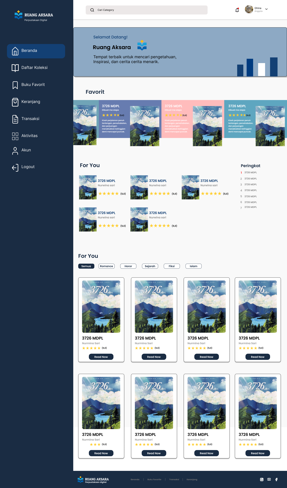
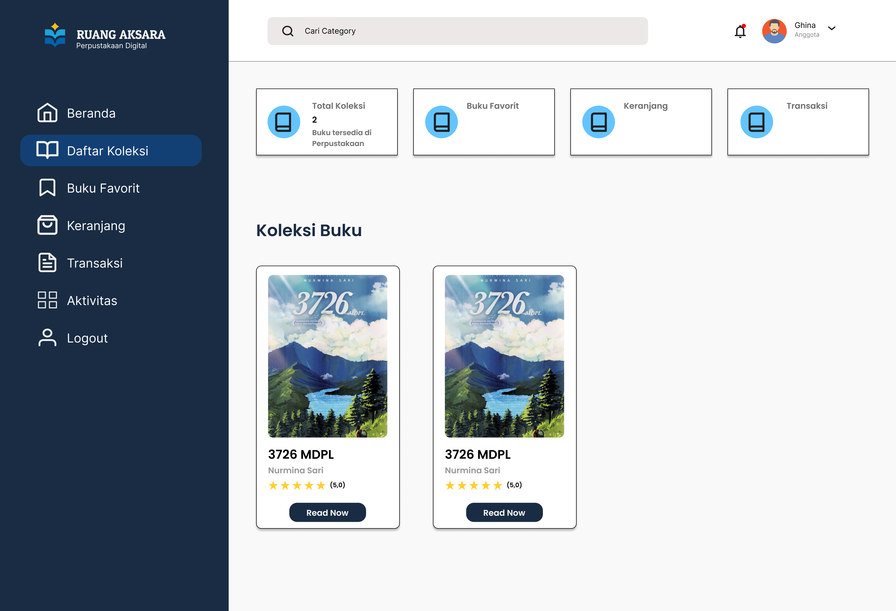
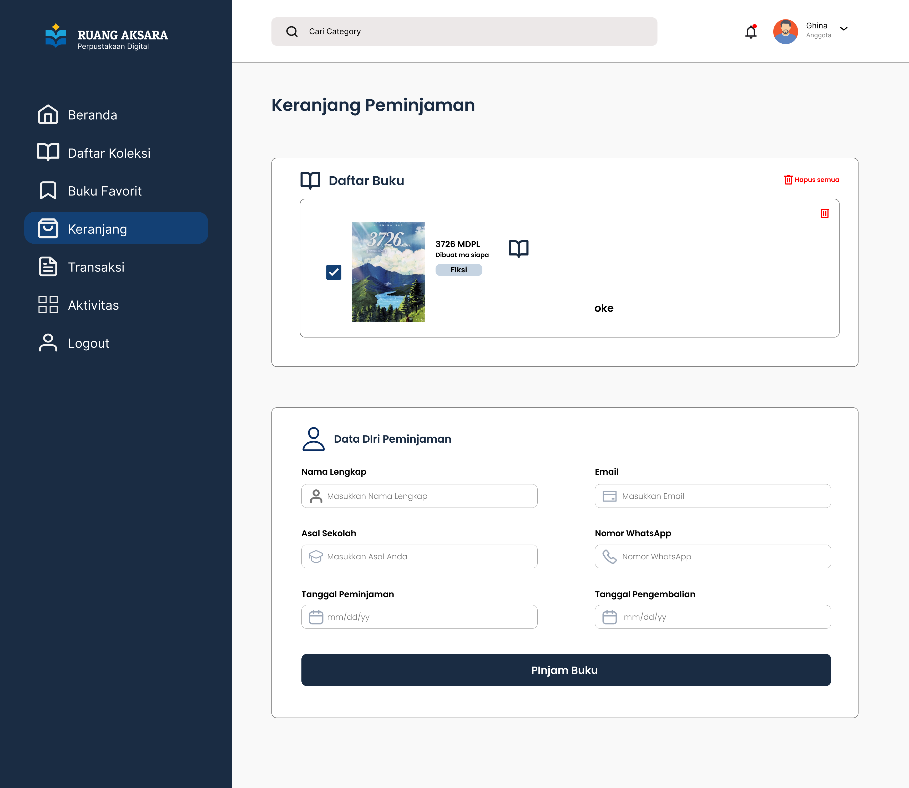
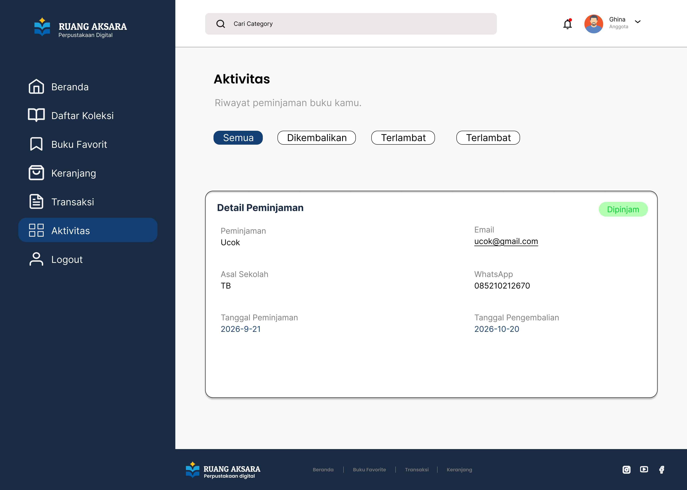
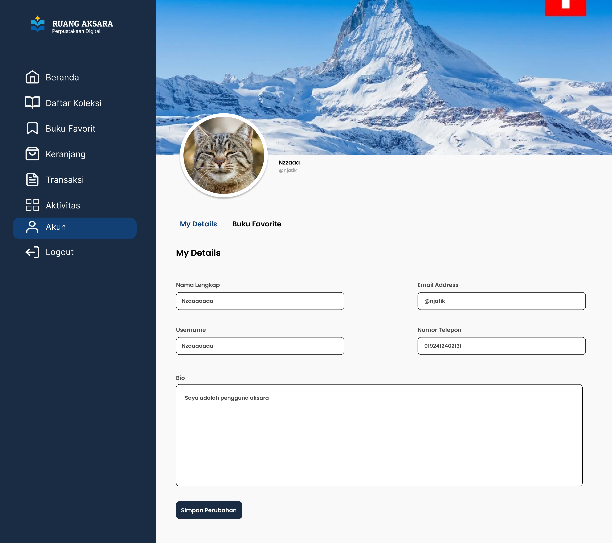

# 📚 Ruang Aksara

**Ruang Aksara** adalah rancangan aplikasi perpustakaan digital yang dibuat untuk memberikan pengalaman membaca dan mengelola koleksi buku secara lebih mudah, modern, dan nyaman.

## 🎯 Tujuan

Ruang Aksara dibuat untuk:

* Mempermudah pengguna menemukan buku.
* Menyediakan tampilan perpustakaan digital yang modern.
* Membantu pengguna mengelola buku favorit.
* Menampilkan aktivitas dan transaksi pengguna dengan jelas.
* Memberikan pengalaman penggunaan yang sederhana dan nyaman.

---

## Color Palette

| Warna     | Hex       |
|---        |        ---|
| Navy Blue | `#134074` |
| Dark Blue | `#13315C` |
| Light Blue| `#8DA9C4` |
| Off White | `#EEF4ED` |

---

## Tools

  **Figma** — UI/UX Design
  **GitHub** — Project Documentation & Version Control

---

## 🔗 Figma

Desain lengkap dapat dilihat melalui Figma:

[🔗 Lihat Desain Ruang Aksara](https://www.figma.com/design/tBX31wXDkRt5naVLvnZj5o/Untitled)

---

## Team Struktur

* 🧪 PM — Hafidz Fracmana Ali Lubis
* 🎨 UI/UX & QA Tester — El Hakim Batubara
* 📔 Front-End — Sistya Ghina Avinza
* 🛜 Back-End — Nafinza Putri Handayani

---

### Halaman yang DiBuat

* 🏠 **Beranda** -

  
* 📚 **Koleksi Buku** -

* 🛒 **Keranjang** -

* 🔔 **Aktivitas** -

* 👤 **Profil** -

 

---

## cara menjalankan sistem

* npm install
* npx @tailwindcss/cli -i ./src/input.css -o ./src/output.css --watch

## 📖 Ruang Aksara

**Digital Library UI/UX Project*

> 📖 Membaca membuka jendela dunia, Ruang Aksara menjadi tempat untuk menjelajahinya
